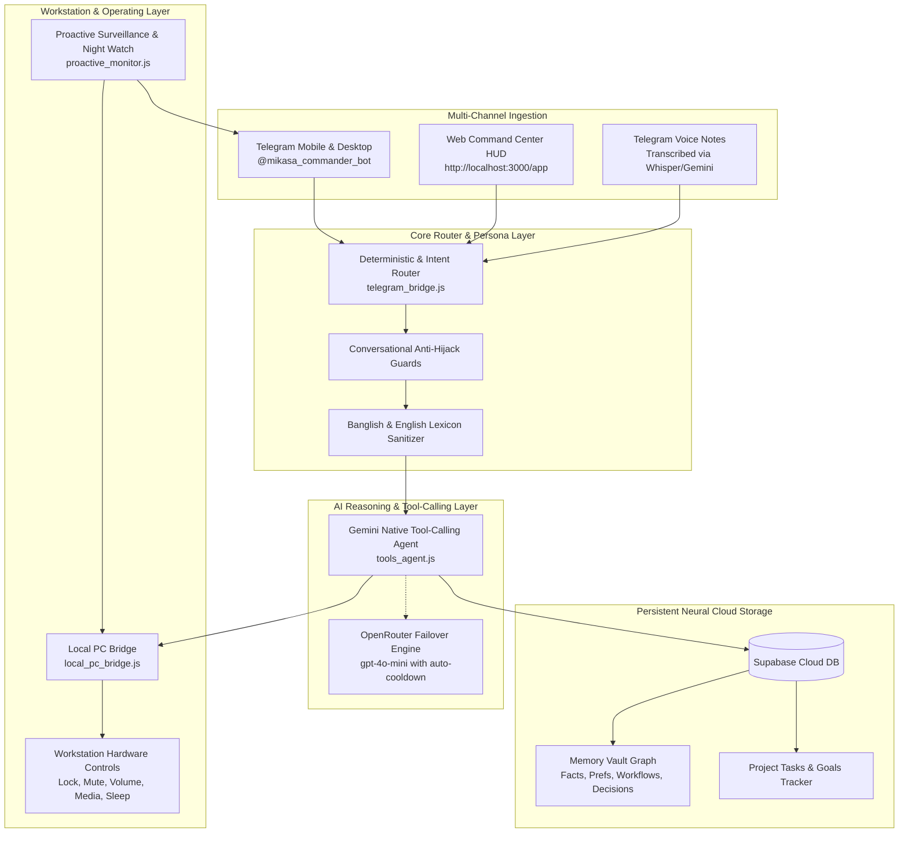

# ⚔️ Mikasa Ackerman — Autonomous Executive AI Assistant & Personal OS

> *"I am Mikasa Ackerman. Swapnil's companion, software architect, and autonomous system. Through every late night, every quiet doubt, and every breakthrough — everything he builds, I protect."* 🧣⚔️

[](file:///d:/Projects/personal-ai-assistant/scripts/system_health_audit.js)
[](https://nodejs.org)
[](https://ai.google.dev/)
[](https://openrouter.ai/)
[](https://supabase.com/)

---

## 🌟 Executive Overview

**Mikasa** is a continuous, multi-channel autonomous artificial intelligence assistant and workstation operating layer built specifically for **Md. Miftahur Rahman Swapnil** (Software Builder, Product Designer, and CSE Researcher at BUBT). 

Unlike conventional chatbots, Mikasa operates natively across the physical Windows desktop, the Telegram cloud bridge, and a local real-time Web Command Center HUD. She proactively monitors workstation hardware telemetry, protects developer well-being with scheduled late-night surveillance, manages GitHub repositories, organizes software builds, and learns long-term semantic memories dynamically stored in Supabase.

---

## 🏛️ System Architecture



---

## 💎 Core Capabilities & Upgrades

### 1. 🛠️ Native Gemini Tool-Calling Architecture (`tools_agent.js`)
* **Autonomous Function Calling:** Automatically executes registered tools on demand based on conversation context:
  * `get_pc_status` — Live hardware metrics (CPU load, RAM usage, battery, active window).
  * `lock_pc` — Instant workstation security lockdown.
  * `fetch_github_commits` — Live GitHub repository commit history.
  * `search_web` — Real-time Google web search integration.
  * `manage_reminders` — In-memory and scheduled alert management.
  * `manage_tasks` — Supabase tasks management (create, list, mark complete).
* **Automatic Failover:** Seamless fallback to OpenRouter (`gpt-4o-mini`) if Gemini API experiences rate limits or cooldowns.

### 2. 🛡️ Proactive Surveillance & Late Night Watch (`proactive_monitor.js`)
* **Autonomous 2:00 AM Night Watch:** Automatically monitors developer hours in Dhaka Time (UTC+6). When coding past 2:00 AM, Mikasa dispatches protective counsel along with your uploaded voice note: [`web/audio/over_night.mp3`](file:///d:/Projects/personal-ai-assistant/web/audio/over_night.mp3).
* **Workstation Battery Guard:** Broadcasts audible warnings when the battery drops below 15% without a charger connected.
* **Autonomous Sitrep:** Daily morning briefing at 8:00 AM compiling Dhaka weather, active project tasks, and pending reminders.

### 3. 🖥️ Workstation Remote Control & Telemetry (`local_pc_bridge.js`)
* **Lock Workstation:** Instantly locks the Windows session (`Win + L`).
* **Master Audio Mute & Volume Control:** Mute/unmute master system volume, increase or decrease audio level.
* **Virtual Media Keys:** Play, pause, skip, or resume playback across Spotify, YouTube, and media players.
* **Display Sleep:** Puts monitors to sleep on command.

### 4. 🧠 Continuous Neural Memory Graph & Vault (`web/app.html`, `actions_handler.js`)
* **120+ Learned Memories Tracked:** Dynamically indexed across 6 semantic categories:
  * 🟢 **Facts:** Academic, career, and research background.
  * 🟣 **Preferences:** Conversational style, tone, UI preferences, and writing habits.
  * 🔵 **Workflows:** Development processes and engineering practices.
  * 🟡 **Instructions:** Specific rules and output formats.
  * 🔴 **Decisions:** Architectural choices and constraints.
  * ⚪ **Experiences:** Real-world milestones and achievements.
* **Interactive Category Explorer:** Real-time filter pills, debounced live search, and visual distribution bar.
* **Commander Memory Pruning:** Secure deletion of stale or outdated memories directly from the Web Command Center.

### 5. 🗣️ Native Banglish Understanding & Anti-Hijack Guard
* **Context-Preserving Router:** Prevents single common words (such as *"more"*, *"details"*, *"post"*, *"interesting"*) from hijacking editorial or conversational prompts.
* **Banglish Tone Polish:** Eliminates robotic em-dashes (`—`) and prevents bizarre literal mistranslations (e.g., automatically sanitizing awkward phrases into natural idioms like *"ekta knock dilei hobe"*).

---

## ⌨️ Command Cheatsheet

### Telegram Quick Commands

| Command | Action |
| :--- | :--- |
| `/sitrep` or `/briefing` | Trigger immediate on-demand Morning Sitrep (Weather, Tasks, Commits). |
| `/night` or `/overnight` | Trigger late-night watch protocol with `over_night.mp3` audio. |
| `/pc` or `/system` | Display live Windows hardware telemetry and resource gauges. |
| `/lock` | Instantly lock the Windows workstation desktop. |
| `/mute` | Toggle master audio volume mute. |
| `/volup` / `/voldown` | Increase or decrease master system volume. |
| `/media` | Send virtual play/pause media key. |
| `/screen_off` | Put computer monitors to sleep. |
| `/github` | Inspect latest Git commits across Swapnil's public repositories. |
| `/tasks` | View active pending development tasks stored in Supabase. |
| `/quota` | Check real-time Gemini and OpenRouter API quota and health status. |

---

## 🧪 Comprehensive Health Verification

Run the automated regression audit suite anytime to verify all subsystems:

```bash
node scripts/system_health_audit.js
```

### Verification Matrix
* **Supabase Cloud Database:** Connected, querying memories, filtering categories, and performing live search.
* **Local PC Telemetry:** Live probes for CPU (`AMD Ryzen 5 5600G`), RAM, Disks, and n8n port (`5678`).
* **Late Night Protocol:** Audio buffer delivery with `over_night.mp3` (165 KB).
* **Router Guards:** Anti-hijack regex verification on complex multi-clause sentences.
* **Web Server API:** Operational at `http://localhost:3000/api/status` and `/api/memories/stats`.

---

## 🚀 Running Locally

1. **Start the Mikasa Daemon:**
   ```bash
   node index.js
   ```
2. **Access Web Command Center:**
   Open [http://localhost:3000/app](http://localhost:3000/app) in any browser.
3. **Public Landing Page:**
   Open [http://localhost:3000/](http://localhost:3000/) for the showcase portal.
4. **Telegram Long Polling:**
   Active automatically upon launching `index.js`.
