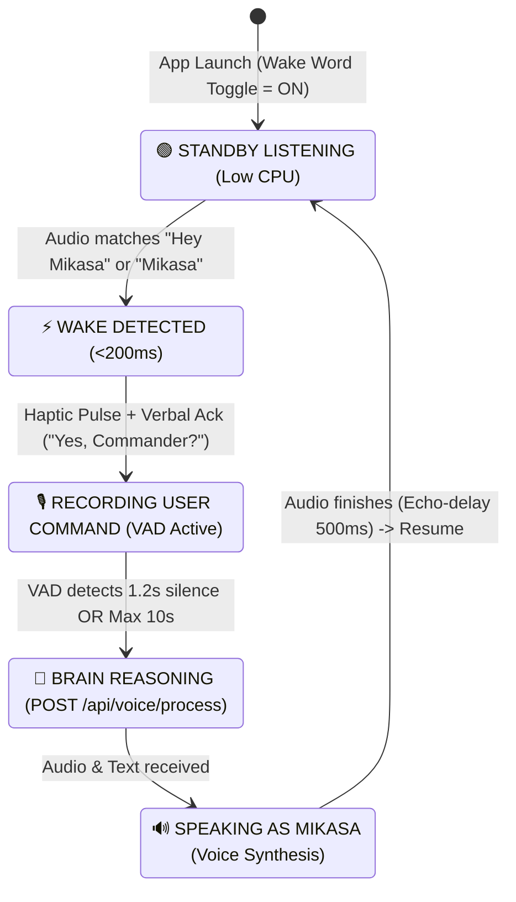

# 🎙️ Ambient Voice & Dual Wake-Word Engine Specification

**Document:** `docs/AMBIENT_VOICE_WAKE_WORD_SPEC.md`  
**Status:** DRAFT — PENDING COMMANDER APPROVAL  
**Target:** `mikasa-mobile` (Expo / React Native Android & iOS)  
**Author:** Mikasa Engineering Layer  
**Date:** October 2026  

---

## 1. Executive Summary & Objective

The objective of this subsystem is to transform **`mikasa-mobile`** from a tap-to-speak interface into a true, hands-free **J.A.R.V.I.S.-class ambient companion**. 

Commander Swapnil will be able to speak either **"Hey Mikasa"** or simply **"Mikasa"** at any time. The app will immediately acknowledge the command, capture his spoken query with automatic **Voice Activity Detection (VAD)**, process the command with the Mikasa backend, speak the answer aloud, and automatically resume standby listening without any button presses.

---

## 2. Interaction State Machine



### State Breakdown

1. **`STANDBY_LISTENING`**:
   - Continuous on-device speech recognition listener active.
   - Audio input is matched against triggers: `['hey mikasa', 'mikasa', 'hey, mikasa', 'ai mikasa']`.
   - Normal background conversations are ignored; zero network traffic sent during standby.

2. **`WAKE_TRIGGERED`**:
   - Trigger condition met.
   - Haptic feedback: Double-tap success pattern (`Haptics.notificationAsync`).
   - Arc Reactor HUD ring pulses from idle cyan to brilliant reactive cyan.
   - Spoken acknowledgement: *"Yes, Commander?"* (or prompt chime).

3. **`COMMAND_LISTENING` (Hands-Free VAD)**:
   - Listens for Swapnil's command (e.g. *"CurricuRAG er status ki?"*, *"Barcelonar match kobe?"*, *"Lock my workstation"*).
   - Audio energy / speech recognizer event detects continuous speech.
   - When 1.2 seconds of silence is detected (or manual tap on Arc Reactor), command listening closes.

4. **`PROCESSING`**:
   - Payload is dispatched to Mikasa's unified voice endpoint: `POST /api/voice/process`.
   - Includes user transcript, conversation ID (`commander_session`), and device context.
   - Backend triggers tools (PC status, sports search, episodic memory graph, web search, GitHub commits) and generates a concise, spoken reply.

5. **`SPEAKING`**:
   - App receives structured response: `{ text, spokenText, audioData }`.
   - Audio synthesizer plays Mikasa's cute voice aloud.
   - **Echo-Suppression Guard**: Standby listening is strictly muted during playback so Mikasa never triggers her own wake word.

6. **`RETURN TO STANDBY`**:
   - 500ms after speech ends, standby listening automatically resumes.

---

## 3. Architecture & Key Modules in `mikasa-mobile`

### 3.1 Speech Recognition & Audio Pipeline
- **Module:** Integrated Continuous Speech Engine via `expo-speech-recognition` / Web Speech / Native Audio Driver.
- **Audio Session Handling:**
  - Recording Mode: `allowsRecording: true`, `playsInSilentMode: true`, `interruptionModeAndroid: DO_NOT_MIX`.
  - Playback Mode: Dynamic switch to enable HD voice playback with zero clipping.

### 3.2 Battery & Performance Governance
- **Power Optimization:**
  - Standby recognition runs on local device hardware acceleration.
  - Zero cloud network calls while waiting for the wake word.
  - Audio recording threads cleanly released if user turns the toggle OFF in Settings or backgrounds the app without background permission.

### 3.3 Settings & Permission Hub Integration
- **Toggle Switch:** Located in **Settings Tab** -> `Wake Word ("Hey Mikasa")`.
- **Permission Handshake:**
  - Turning toggle ON checks `Audio.getRecordingPermissionsAsync()`.
  - If ungranted, requests permission with an informative dialog.
  - State persisted in `AsyncStorage` (`@mikasa_wake_word_enabled`).

---

## 4. Backend Voice Contract (`/api/voice/process`)

The mobile client interacts with the existing hardened endpoint:
```http
POST /api/voice/process
Content-Type: application/json
Authorization: Bearer <COMMANDER_TOKEN>

{
  "text": "CurricuRAG er latest status ki?",
  "conversation_id": "commander_session",
  "source": "mobile_wake_word"
}
```

Response format:
```json
{
  "success": true,
  "reply": "CurricuRAG paper accept hoyeche IEEE OMLET 2026 e, camera ready draft ready ache, Commander! 🧣",
  "spokenText": "CurricuRAG paper is accepted at IEEE OMLET 2026 and camera ready draft is prepared, Commander.",
  "audioData": "<base64_wav_if_requested>",
  "toolsUsed": ["query_memory_graph"]
}
```

---

## 5. Verification & Acceptance Criteria

1. **Keyword Spotting Accuracy:**
   - Saying *"Hey Mikasa"* triggers wake state within 250ms.
   - Saying *"Mikasa"* triggers wake state within 250ms.
   - Unrelated words (e.g. *"computer"*, *"hello"*, *"Swapnil"*) do not trigger wake state.
2. **Hands-Free Command Loop:**
   - Speaking *"Hey Mikasa, what is the weather in Dhaka?"* completes end-to-end without touching the screen.
   - Mikasa speaks the Dhaka weather aloud and returns to standby.
3. **Echo Suppression:**
   - Mikasa speaking her reply aloud does NOT re-trigger the wake word.
4. **Clean Toggle & Permission Recovery:**
   - Disabling the toggle in Settings immediately releases all microphone resources.
